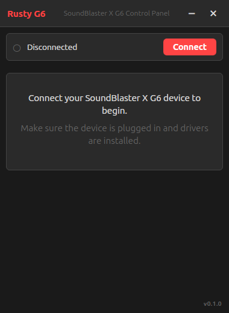
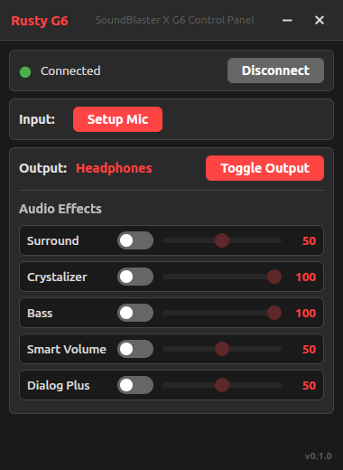
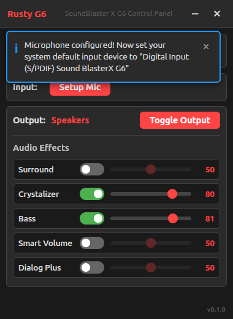

# Rusty G6

**Cross-platform GUI for SoundBlaster X G6 control**

[](https://opensource.org/licenses/MIT)
[](https://github.com/jackbrumley/rusty-g6)
[](https://tauri.app/)

*Modern GUI for controlling SoundBlaster X G6 features on Linux and Windows*

---

## Features

- **Output Control** - Switch between Speakers and Headphones
- **Surround Sound** - Enable/disable and adjust intensity (0-100)
- **Crystalizer** - Control clarity enhancement (0-100)
- **Bass Boost** - Adjust bass levels (0-100)
- **Smart Volume** - Volume normalization with Night/Loud presets (0-100)
- **Dialog Plus** - Voice clarity enhancement (0-100)
- **Microphone Setup** - One-click microphone configuration for Linux
- **Settings Persistence** - Preferences saved automatically
- **System Tray** - Minimize to tray, quick access via tray icon

## Why Rusty G6?

Creative provides excellent Windows software but offers no support for Linux or macOS. While the G6 functions as a basic USB audio interface on these platforms, all advanced features are completely inaccessible.

The only existing solution is [soundblaster-x-g6-cli](https://github.com/nils-skowasch/soundblaster-x-g6-cli) - a command-line tool. Rusty G6 is the first graphical interface for controlling the G6 outside of Windows.

## Screenshots







## Installation

### Prerequisites

**Linux** - Install libusb and create udev rule:
```bash
# Debian/Ubuntu
sudo apt-get install libusb-1.0-0-dev

# Create udev rule
echo 'SUBSYSTEM=="usb", ATTRS{idVendor}=="041e", ATTRS{idProduct}=="3256", TAG+="uaccess"' | sudo tee /etc/udev/rules.d/50-soundblaster-x-g6.rules
sudo udevadm control --reload-rules && sudo udevadm trigger
```

**Windows** - No additional setup required.

### Download

**[Download Latest Release](https://github.com/jackbrumley/rusty-g6/releases/latest)**

- **Linux**: `.deb`, `.AppImage`, or standalone binary
- **Windows**: `.msi` installer or `.exe`

### Building from Source

See [docs/build-guide.md](docs/build-guide.md) for build instructions.

## Disclaimer

This software communicates directly with USB hardware using reverse-engineered protocols. **Use at your own risk.** The authors are not responsible for any damages to your system or device.

## Technology

- **[Tauri](https://tauri.app/)** - Desktop framework
- **[Rust](https://www.rust-lang.org/)** - Backend and USB communication
- **[Preact](https://preactjs.com/)** - Frontend UI
- **[rusb/hidapi](https://github.com/libusb/libusb)** - USB HID communication

## Technical Details

- **USB Vendor ID**: `041e` (Creative Technology Ltd)
- **USB Product ID**: `3256` (Sound Blaster X G6)
- **Protocol**: USB HID with interrupt transfers

### Documentation

- **[USB Protocol Implementation](docs/usb-protocol.md)** - Our implementation details
- **[Original USB Specification](https://github.com/nils-skowasch/soundblaster-x-g6-cli/blob/main/doc/usb-spec.txt)** - Hex command reference
- **[Build Guide](docs/build-guide.md)** - How to build from source

## Credits

This project is built on the reverse engineering work by **[Nils Skowasch](https://github.com/nils-skowasch)**.

His [soundblaster-x-g6-cli](https://github.com/nils-skowasch/soundblaster-x-g6-cli) project reverse-engineered the complete USB protocol for the G6. Rusty G6 uses this protocol documentation for all USB communication.

**If you find this project useful, please also star the [original CLI project](https://github.com/nils-skowasch/soundblaster-x-g6-cli).**

## License

This project is licensed under the MIT License - see the [LICENSE](LICENSE) file for details.
