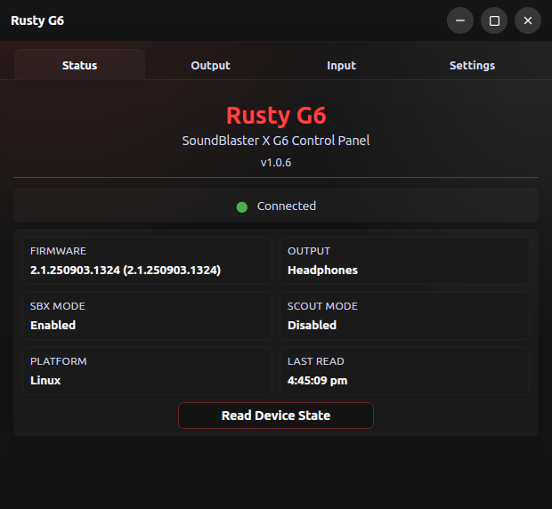
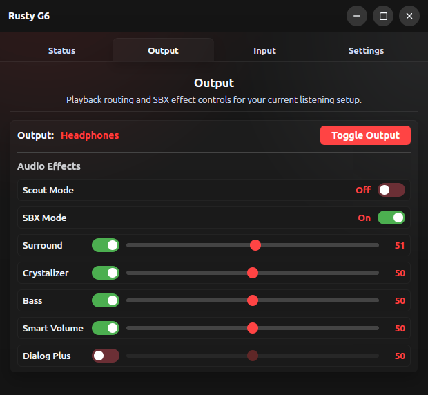
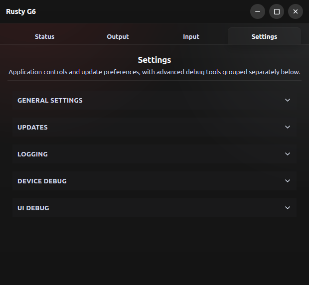

<p align="center">
  
</p>

<h1 align="center">Rusty G6</h1>

<p align="center">Simple desktop control panel for the Sound BlasterX G6.</p>

<p align="center">
  <a href="https://opensource.org/licenses/MIT"></a>
  <a href="https://github.com/jackbrumley/rusty-g6"></a>
  <a href="https://tauri.app/"></a>
</p>

<p align="center">
  <a href="https://github.com/jackbrumley/rusty-g6/releases/latest"></a>
</p>

Rusty G6 is a GUI app that lets you control Sound BlasterX G6 features without command-line tools.

It exists because there is no official Linux client for the G6, and advanced controls are hard to access outside Creative's Windows software. Rusty G6 provides a cleaner desktop experience for Linux users and is also available on Windows.

## What You Can Do

- Switch output between speakers and headphones
- Adjust SBX effects like Surround, Crystalizer, Bass, Smart Volume, and Dialog Plus
- Configure microphone setup and boost
- Check app updates from the Settings tab
- Copy/open session logs for troubleshooting

## Screenshots





## Install

Download the latest release here:

- **[Download Latest Release](https://github.com/jackbrumley/rusty-g6/releases/latest)**

### Linux

Linux packages include dependency and USB permission setup.

- `.deb` (Debian/Ubuntu/Mint)
- `.rpm` (Fedora/RHEL/CentOS)
- `.AppImage` (portable Linux)

Install by opening the package from the release page with your distro's package installer.

### Windows

Download and run the `.msi` installer from the latest release.

## Why This Project Exists

There is no official Linux client for the G6. On Linux, the device works as a basic audio interface, but advanced controls are not easily available.

Rusty G6 builds on the reverse-engineering work from [soundblaster-x-g6-cli](https://github.com/nils-skowasch/soundblaster-x-g6-cli) and provides a user-friendly desktop interface.

## Build From Source

```bash
git clone https://github.com/jackbrumley/rusty-g6
cd rusty-g6
npm install
npm run tauri:build
```

For more detail, see [docs/build-guide.md](docs/build-guide.md).

## Technical Notes

- USB Vendor ID: `041e` (Creative Technology Ltd)
- USB Product ID: `3256` (Sound BlasterX G6)
- Protocol: USB HID with interrupt transfers

Documentation:

- [USB Protocol Implementation](docs/usb-protocol.md)
- [Reference USB Specification](docs/rusty-g6-usb-spec.md)

## Disclaimer

This software communicates directly with USB hardware using reverse-engineered protocols. Use at your own risk.

## Credits

Special thanks to **[Nils Skowasch](https://github.com/nils-skowasch)** and the
[soundblaster-x-g6-cli](https://github.com/nils-skowasch/soundblaster-x-g6-cli) project for the protocol reverse engineering foundation.

## License

MIT - see [LICENSE](LICENSE).
